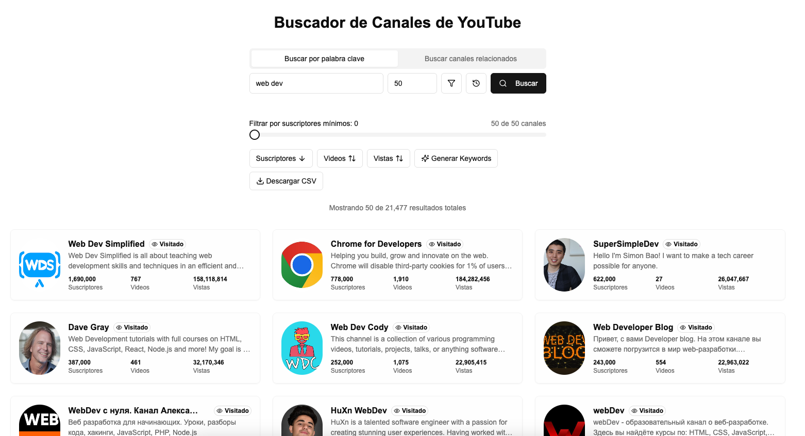
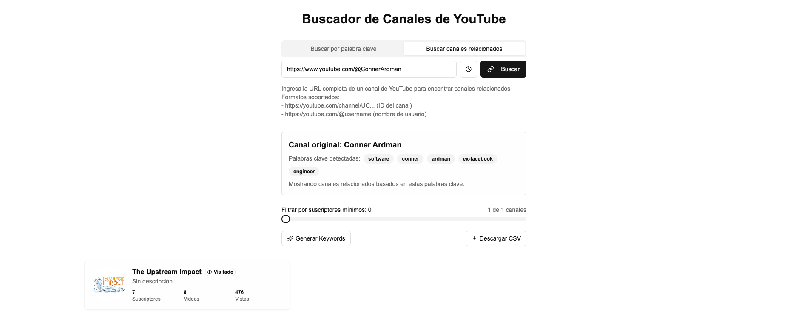
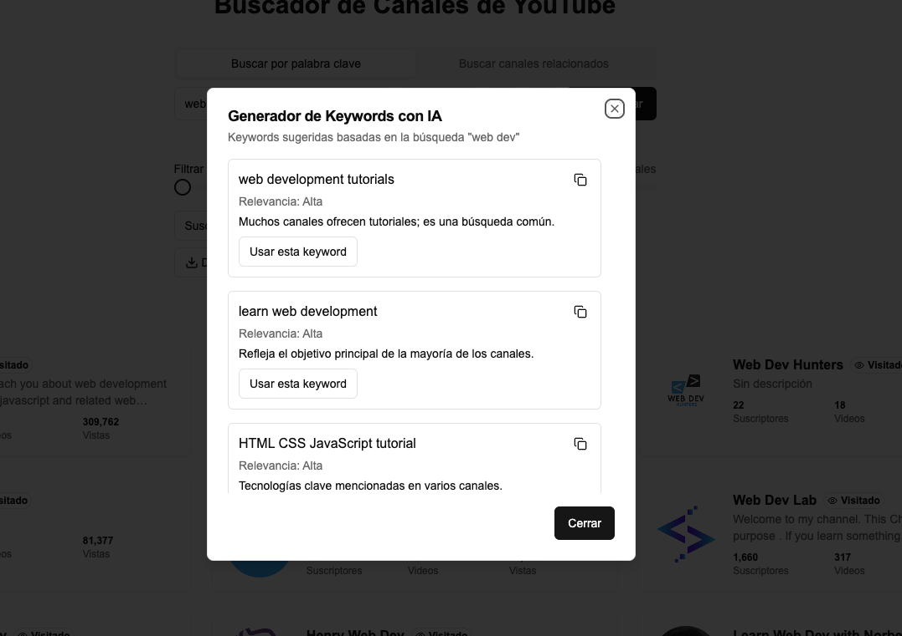
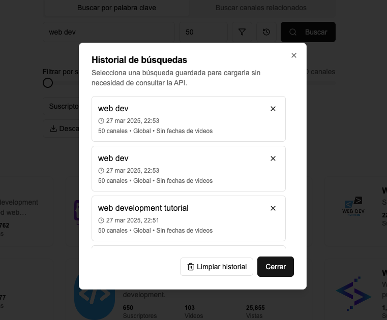
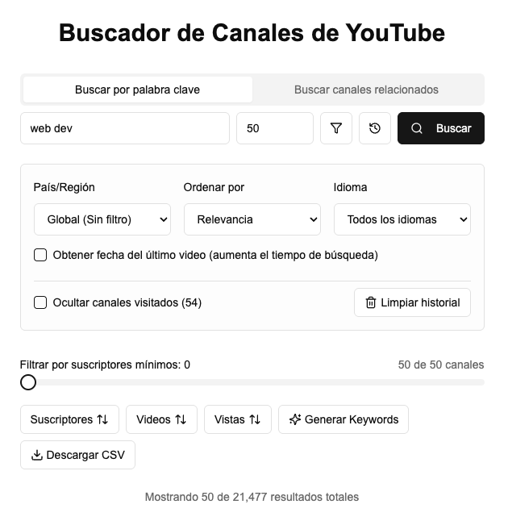

# YouTube Channel Search

Una aplicación web moderna para buscar y explorar canales de YouTube. Construida con Next.js, TypeScript y Tailwind CSS.

## 🎯 Propósito

Esta aplicación te permite descubrir y suscribirte a canales de YouTube especializados en temas específicos. Es perfecta para:

- Encontrar canales expertos en cualquier tema o área de interés
- Mantenerte actualizado con contenido relevante de YouTube
- Organizar tus suscripciones por temas
- Descubrir nuevos creadores de contenido en tu área de interés

## 📸 Capturas de Pantalla

### Búsqueda por Palabra Clave

*Interfaz principal para buscar canales por palabra clave*

### Búsqueda de Canales Relacionados

*Búsqueda de canales relacionados con un canal específico*

### Generador de Keywords con IA

*Generador de keywords usando IA basado en los canales encontrados*

### Historial de Búsquedas

*Historial de búsquedas guardadas*

### Filtros y Ordenamiento

*Opciones de filtrado y ordenamiento de resultados*

## 🚀 Características

- Búsqueda de canales por palabra clave
- Búsqueda de canales relacionados
- Filtrado por suscriptores
- Ordenamiento por diferentes criterios
- Generación de keywords con IA
- Historial de búsquedas
- Exportación a CSV
- Interfaz moderna y responsiva

## 📝 Uso

1. **Búsqueda por Palabra Clave**:
   - Ingresa una palabra clave en el campo de búsqueda
   - Ajusta los filtros según necesites
   - Haz clic en "Buscar"

2. **Búsqueda de Canales Relacionados**:
   - Pega la URL de un canal de YouTube
   - Haz clic en "Buscar"
   - Explora los canales relacionados

3. **Generación de Keywords**:
   - Después de una búsqueda, haz clic en "Generar Keywords"
   - Usa las keywords sugeridas para nuevas búsquedas

4. **Exportación de Datos**:
   - Usa el botón "Descargar CSV" para exportar los resultados

## 🤖 Funcionalidad de IA

La aplicación utiliza Google Gemini para mejorar la experiencia de búsqueda:

- Analiza tu término de búsqueda y los canales encontrados
- Genera sugerencias de búsqueda relacionadas
- Ayuda a filtrar y encontrar canales más específicos
- Mejora la precisión de los resultados

## 🛠️ Tecnologías Utilizadas

- [Next.js](https://nextjs.org/) - Framework de React
- [TypeScript](https://www.typescriptlang.org/) - Lenguaje de programación tipado
- [Tailwind CSS](https://tailwindcss.com/) - Framework CSS
- [Radix UI](https://www.radix-ui.com/) - Componentes UI accesibles
- [React Hook Form](https://react-hook-form.com/) - Manejo de formularios
- [Zod](https://zod.dev/) - Validación de esquemas
- [Google Gemini](https://ai.google.dev/) - IA para sugerencias de búsqueda

## 📋 Prerrequisitos

- Node.js 18.x o superior
- npm o yarn
- API Key de YouTube Data API v3
- API Key de Google Gemini

## 🔧 Instalación

1. Clona el repositorio:
```bash
git clone https://github.com/JoaquinMayer/youtube-channel-search.git
cd youtube-channel-search
```

2. Instala las dependencias:
```bash
npm install
# o
yarn install
```

3. Configura las variables de entorno:

   a. Obtén una API Key de YouTube:
   - Ve a [Google Cloud Console](https://console.cloud.google.com/)
   - Crea un nuevo proyecto o selecciona uno existente
   - Habilita la YouTube Data API v3
   - Ve a "Credenciales" y crea una nueva API Key
   - Restringe la API Key para mayor seguridad (opcional pero recomendado)

   b. Obtén una API Key de Gemini:
   - Ve a [Google AI Studio](https://makersuite.google.com/app/apikey)
   - Crea una nueva API Key
   - Habilita la API de Gemini en tu proyecto de Google Cloud
   - La API Key es gratuita para uso básico

   c. Crea un archivo `.env` en la raíz del proyecto:
   ```env
   YOUTUBE_API_KEY=tu_api_key_aqui
   GEMINI_API_KEY=tu_api_key_aqui
   ```

   > ⚠️ **Nota**: La API Key de YouTube tiene cuotas de uso diarias. Para desarrollo, la cuota gratuita debería ser suficiente.
   > Puedes consultar los límites de cuota y el uso actual en la [Consola de Google Cloud](https://console.cloud.google.com/apis/dashboard).
   > La cuota gratuita incluye 10,000 unidades por día, donde cada operación consume un número diferente de unidades.
   > Por ejemplo, una búsqueda de canales consume 100 unidades.

4. Inicia el servidor de desarrollo:
```bash
npm run dev
# o
yarn dev
```

5. Abrir [http://localhost:3000](http://localhost:3000) en tu navegador.

## 🤝 Contribuir

Las contribuciones son bienvenidas. Por favor, abre un issue primero para discutir los cambios que te gustaría hacer.

## 📄 Licencia

Este proyecto está bajo la Licencia MIT - ver el archivo [LICENSE](LICENSE) para más detalles.

## 👥 Autores

- Joaquin Mayer - [@JoaquinMayer](https://github.com/JoaquinMayer)

## 🙏 Agradecimientos

- [Next.js](https://nextjs.org/)
- [Tailwind CSS](https://tailwindcss.com/)
- [Radix UI](https://www.radix-ui.com/)
- [YouTube Data API v3](https://developers.google.com/youtube/v3/docs/search/list?hl=es-419) - Documentación oficial de la API
- [Google Gemini](https://ai.google.dev/) - IA para sugerencias de búsqueda

## 🧪 Testing

Para ejecutar los tests:

```bash
npm run test
# o
yarn test
```

### Tipos de Tests

- **Unit Tests**: Tests unitarios para componentes y funciones
- **Integration Tests**: Tests de integración para flujos completos
- **E2E Tests**: Tests end-to-end con Cypress

## 🔌 API Reference

### YouTube Data API

#### Búsqueda de Canales

```typescript
GET /api/search/channels
```

| Parámetro | Tipo     | Descripción                |
| :-------- | :------- | :------------------------- |
| `query`   | `string` | Término de búsqueda        |
| `maxResults` | `number` | Número máximo de resultados |
| `pageToken` | `string` | Token para paginación      |

#### Canales Relacionados

```typescript
GET /api/channels/related
```

| Parámetro | Tipo     | Descripción             |
| :-------- | :------- | :---------------------- |
| `channelId` | `string` | ID del canal de YouTube |

### Gemini AI API

```typescript
POST /api/ai/generate-keywords
```

| Parámetro | Tipo     | Descripción                    |
| :-------- | :------- | :----------------------------- |
| `query`   | `string` | Término de búsqueda original   |
| `results` | `array`  | Resultados de búsqueda previos |

## 💻 Guías de Desarrollo

### Estructura del Proyecto

```
youtube-channel-search/
├── app/                    # Rutas y páginas de Next.js
├── components/             # Componentes React reutilizables
├── hooks/                  # Custom hooks
├── lib/                    # Utilidades y configuraciones
├── public/                 # Archivos estáticos
├── styles/                 # Estilos globales y configuración de Tailwind
└── tests/                  # Tests unitarios y de integración
```

### Convenciones de Código

- Usar TypeScript para todo el código
- Seguir el estilo de código de Prettier
- Documentar componentes y funciones con JSDoc
- Usar nombres descriptivos en inglés
- Mantener los componentes pequeños y reutilizables

### Git Workflow

1. Crear una rama desde `main` para cada feature/fix
2. Seguir la convención de commits:
   - `feat:` para nuevas características
   - `fix:` para correcciones de bugs
   - `docs:` para cambios en documentación
   - `refactor:` para refactorizaciones
   - `test:` para añadir o modificar tests
3. Crear Pull Requests con descripción detallada
4. Requerir al menos una revisión antes de merge

### Performance

- Usar Image Optimization de Next.js
- Implementar lazy loading para componentes pesados
- Minimizar el uso de JavaScript del lado del cliente
- Optimizar las llamadas a la API de YouTube

## 🔄 CI/CD

El proyecto utiliza GitHub Actions para:

- Ejecutar tests automáticamente
- Verificar el estilo de código
- Construir y desplegar la aplicación
- Generar reportes de cobertura

## 📊 Monitoreo

- Uso de Vercel Analytics para métricas de rendimiento
- Monitoreo de cuota de API de YouTube
- Logging de errores con Sentry 